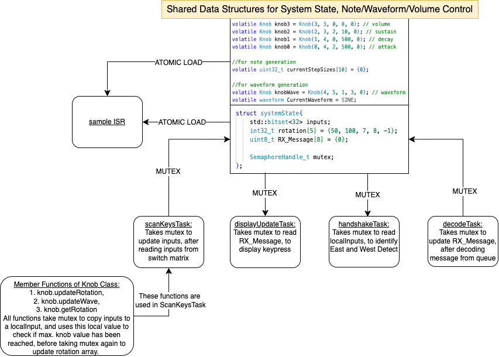
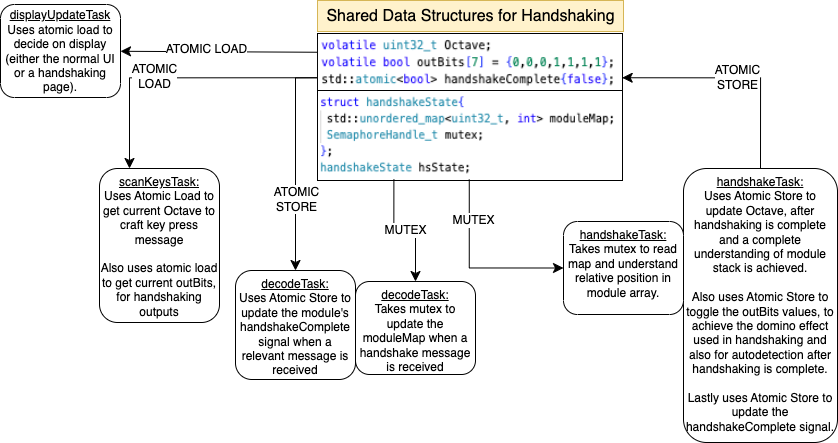
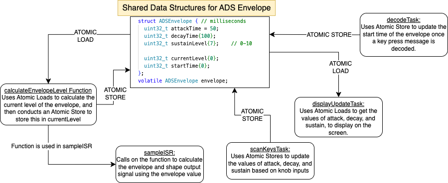
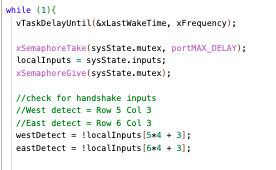
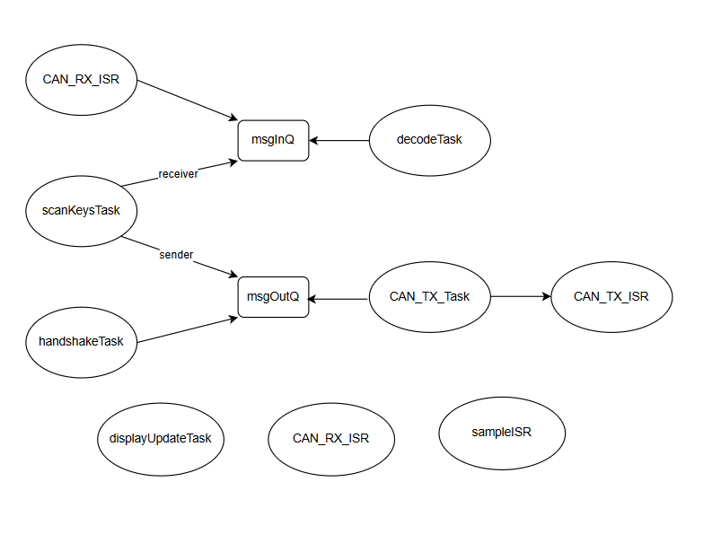
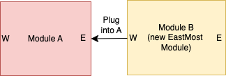

# ES CW2 - BLT Synthesiser
## **Core Functionalities**  
### **1. Plays note upon keypress**  
- When a key press event is detected (in `scanKeysTask`), a message is passed to `decodeTask` to update the step size based on which note is pressed.  
- A hardware timer runs at **22 kHz** to call `sampleISR()`, which generates the sound based on this step size.  
- **4 waveforms** are defined:  Sawtooth , Sine , Triangle , Square  
- The current step size controls the pitch, outputting a musical tone appropriate to the selected waveform.  

### **2. Volume Control**  
- **Knob 3** is used to control volume.  
  - A change in rotation is recorded and translated to an increment/decrement in volume.  
- **Range:** **0-8**  
- **Volume Control Mechanism:**  
  - Volume is adjusted by shifting the wave output in `sampleISR()`:  
    ```c
    Vout = Vout >> (8 - localVolume);
    ```
  - A **log taper volume control** is used, where:  
    - A volume of **8** sets it to the original value.  
    - Further decreases shift it by corresponding bits to the right.  

### **3. OLED display and user controls**  
- The OLED display refreshes every 100ms (via u8g2.sendBuffer(), and shows information about the current settings. Controls are also shown and are updated. An LED is toggled within the displayUpdateTask.
  - **Volume:** **0-8**  
  - **Waveform:** **SAW, SINE, TRI, and SQR**  
  - **Envelope settings:**  
    - **A (Attack):** Time spent before hitting maximum peak in the envelope.  
    - **D (Decay):** Time spent after peak to go back down to the sustain level.  
    - **S (Sustain):** The final volume at which the note remains until released.  
  - **Current Note Played:** Displays both **octave** and **note**.  

### **4. Sender vs Receiver**  
- The module is configured to be either a **sender** or **receiver** via **compile-time macros**.  
- **Sender Mode:**  
  - Key events are transmitted over **CAN**.  
  - When a key transitions from **not pressed to pressed**, it prepares a message:  
    ```c
    TX_Message[0] = 0x50;
    ```  
  - The message is queued to `msgOutQ`.  
- **Receiver Mode:**  
  - Incoming **CAN messages** trigger note playback.  
  - The `decodeTask()` receives messages from `msgInQ` instructing it to **play or stop** a note.  
- **Multiple Keyboard Usage:**  
  - Only **one** module should be configured as a **receiver**.  
  - The remaining keyboards should be configured as **senders**.  

## **Advanced Features**  

### **1. Handshaking and Autodetection**  
Handshaking is implemented by 

### **2.Waveforms**  
4 different waveforms are implemented in our system:  
1. **Sawtooth:**  
   - This was the initial wave created in the core functionality, and is done by increasing the value by a certain step size, and waiting for overflow to occur. Different notes have different step sizes, allowing overflow to be faster or slower. 
2. **Sine:**  
   - Implemented through a lookup table that is initialized and calculated at the start of the program.  
3. **Triangle:**  
   - Splits into a rising and falling portion based on the sign of phase accumulation.  
4. **Square:**  
   - Outputs either high or low depending on the sign of `phaseAcc`.  

Interrupts were used as the wave creation was already done inside the `sampleISR()` function.  

### **3. ADS Envelope**  
Three controls were implemented to make the synthesizer sound closer to real instruments:  
1. **Attack** - Time taken to reach max volume after a key is pressed.  
2. **Decay** - Time taken to drop down from max volume.  
3. **Sustain** - Final level at which the note remains until released.  
By changing the ADS values, an envelope is applied to the output wave and note produced can sound like instruments such as the flute, the violin, and more. 

### **4. Polyphony: Allowing multiple simultaneous notes to be played at once**  
Polyphony is achieved by mixing the waveforms of multiple notes to generate a composite output signal.  
Polyphony is implemented using:
- **sampleISR()**  
  - Each key press updates the `currentStepSizes` array, which stores up to **10 active step sizes (frequencies).**  
  - The output (`vout`) is then calculated by processing the phase accumulation for each active step based on the waveform selected, summing the results together, and scaling by volume and envelope settings.  
- **decodeTask()**  
  - Updates `currentStepSizes` when a new key is pressed or released.  
  - Ensures that new notes are dynamically added to the active list.  
- **scanKeysTask()**  
  - Detects key presses and releases, sending messages to `decodeTask()`.  

### **5.User Controls**  
The synthesizer output can be adjusted using the following controls. Any changes will be reflected on the OLED display as well:  
- **Volume:** Controlled by turning Knob 3.  
- **Waveform Selection:** Pressing Knob 3 cycles through SAW, SINE, TRI, and SQR.  
- **Envelope settings:**  
  - Knob 0, 1, and 2 are used to control attack, decay, and sustain respectively

## Tasks -- Threads and Interrupts

| Task | Purpose | Implementation | Thread/ Interrupt | Concurrency |
| :---- | :---- | :---- | :---- | :---- |
| \`\`\`scanKeysTask\`\`\` | To detect keypresses by scanning the key matrix | Loops through the key matrix and reads columns. The relevant inputs are then extracted and updated to global variables.  Key press messages are sent to the CAN bus queue. | Thread | Mutex for updating inputs Atomic stores for envelope and waveform values |
| \`\`\`decodeTask\`\`\` | Messages from both the keyboard and the  CAN bus queue are read and processed. | Queue message is read and processed based on what message is sent \- either pressed, released, start handshake, or handshake completed. **Pressed:** Updates step size and records start time **Released:** Updates step size to 0 **Start handshake:** Reads module ID and stores to module map **Complete handshake:** Either handshake successful or failed. Stores if successful, updates handshake boolean if not. | Thread | Semaphore for sysState Atomic load and store for stepsize and handshake Atomic store for envelopes and physical signals |
| \`\`\`CAN\_TX\_Task\`\`\` | Send messages to CAN bus. | Takes the CAN\_TX\_Semaphore to reserve an outgoing mailbox. | Thread | Semaphore to ensure mailbox slots are not oversubscribed |
| \`\`\`handshakeTask\`\`\` | Used to connect multiple keyboards.  Keyboards automatically know when a new set of keys have been plugged in or out, and update their octave according to their position in the array of keys.  | Keyboards establish global understanding of the system by sending and receiving messages through a CAN bus. Like a domino effect, the west-most module initiates a handshake and each connected module sends messages one by one, until the east-most module sends a message to conclude handshaking.   | Thread | Mutex for module map Atomic stores for handshaking flag and physical signals output. |
| \`\`\`displayUpdateTask\`\`\` | Display for user controls (volume, waveform, envelope values) and displays note pressed. | Accesses global values to update display screen. | Thread | Mutex to load sysState global variables (volume and RX\_message) Atomic loads from envelope and waveform global variables, as well as for handshaking flag. |
| \`\`\`CAN\_TX\_ISR\`\`\` | Transmit Interrupt. | Returns the CAN\_TX\_Semaphore. | Interrupt | Gives back semaphore so that the CAN\_TX\_Task can send another message |
| \`\`\`CAN\_RX\_ISR\`\`\` | Receive Interrupt. | When a message is received via CAN, it reads the message and sends it to the msgInQ queue. | Interrupt | - |
| \`\`\`sampleISR\`\`\` | Accesses phase accumulator and synthesizes waveforms based on selected waveform shape and current step size. | Accumulates phase and processes it based on note pressed current step size, selected waveform, envelope settings, and volume control. This is then output at a rate of 22kHz as audio. | Interrupt: Requires fast response to ensure accurate audio output | Atomic operations: All accesses can be completed in a single memory access |

## Initiation intervals and Execution time
 
### Theoretical Minimum Initiation intervals
| Task | Theoretical initiation interval $\tau_i$ /ms  | Assumptions and Calculation | 
|----------|----------|----------|
| scanKeysTask | 20.0 | Highest sample rate to capture keypresses and small changes in knob rotation |
| decodeTask  | 25.2 | 36 messages can be put into the MsgInQ by the CAN_RX_ISR in 36 * 0.7ms, decode task needs to process these 36 messages in an initiation interval, making the initiation time 36 * 0.7ms = 25.2ms |
| CAN_TX_Task | 57.6 | **Worst Case Scenario:** ScanKeys task creates 12 messages every 20ms, and HandShake task creates 2 messages every 80ms.  On average, 50 messages will be created in 80ms, so 1 message every 1.6ms. The msgOutQ will be filled in 1.6ms * 36 = 57.6ms. CAN_TX_Task needs to have an initiation time of 57.6ms to clear the buffer.|
| handshakeTask | 80.0 | Needs to have higher priority than displayUpdateTask, because handshakeTask controls what should be output on screen. However, since changes in handshaking are slow (time taken to piece together 2 modules or remove a module is tens of seconds), so should be lower than CAN_TX_Task.|
| displayUpdateTask | 100 | Lowest priority and longest initiation interval. LED in function set to blink every 100ms as per specification. |
| CAN_TX_ISR | 1.6 | CAN_TX_Task sends a message every 1.6ms, so semaphore must be given back every 1.6ms as well so messages can be continuously transmitted. |
| CAN_RX_ISR | 1.6 | CA message can be transmitted every 0.7ms, and each message needs to be acknowledged. So the initiation interval should be 0.7ms. |
| sampleISR | 0.04545 | Frequency of ISR timer is set to 22kHz, thus initiation interval = 1/22kHz.|

### Maximum Measured Execution time 
| Task | Maximum execution time $T_i$ /ms | Assumptions and Calculation | 
|----------|----------|----------|
| scanKeysTask | 0.18 | Simulate 12 keys being pressed at once, 12 messages sent. |
| decodeTask  | 0.67 | The queue is pre-filled with 36 messages, and decodeTask is run until the queue is empty. |
| CAN_TX_Task | 0.16 | Queue messages for simulation and prevent semaphores from hanging by setting 0 ticks. Added testing CAN_TX for simulation. |
| handshakeTask | 0.13 | Critical path is performing search through the module map for own position, and to send a message if a plug in is detected.|
| displayUpdateTask | 14.93 | Time taken to update whole display |
| CAN_TX_ISR | 0.0015 | Simulate with xSemaphoreGive (instead of xSemaphoreGiveFromISR )so that functionality and timing can be tested without requiring the full RTOS setup |
| CAN_RX_ISR | 0.0017 | Simulate with xQueueSend (instead of xQueueSendFromISR)so that functionality and timing can be tested without requiring the full RTOS setup |
| sampleISR | 0.0192 | Reported result is the average of 1000 runs |

## Real Time System Analysis 

| Task | Theoretical initiation interval $\tau_i$ /ms | Maximum execution time $T_i$ /ms | $[\frac{\tau_n}{\tau_i}] T_i$ | CPU Usage: $\frac{T_i}{\tau_i}$ /%
|----------|----------|----------|----------|----------|
| scanKeysTask | 20 | 0.18 | 0.9 | 0.9 |
| decodeTask  | 25.2 | 0.67 | 2.68 | 2.66 |
| CAN_TX_Task | 57.6 | 0.16 | 0.32 | 0.27 |
| handshakeTask | 80 | 0.13 | 0.26 | 0.16 |
| displayUpdateTask | 100 | 14.93 | 14.93 | 14.93 |
| CAN_TX_ISR | 1.6 | 0.0015 | 0.0.0945 | 0.09 |
| CAN_RX_ISR | 0.7 | 0.0017 | 0.2431 | 0.24 |
| sampleISR | 0.04545 | 0.0192 | 42.2592 | 42.259 |
| Total     | | | 61.6868 | 61.49 |

## Quantification of total CPU utilisation
**Total latency is 61.6868ms**. This is less than the latency of the lowest priority task which is displayUpdateTask with an initiation interval of 100ms ($\tau_n$), indicating that all tasks are completed within the timeframe. The total CPU usafe is **61.49%**.

## Shared Data Structures and Safe Access
### Shared variables for System State, Note/Waveform/Volume Control


### Shared variables for Handshaking


### Shared variables for Attack, Decay and Sustain Envelope


Safe accesses to global variables and synchronisation is done through the use of Mutexes and Atomic Stores/Loads. 

### Inter-task dependencies 
In our design, global variables are accessed using mutexes and atomic loads/stores to ensure tasks can be synchronised and concurrent resource accesses are thread-safe.

However, if a task holds a mutex and another task tries to take the mutex, the task is blocked until data can be accessed. This can lead to deadlocks, and our code avoids deadlocks in the following ways: 
1. A mutex is taken only to copy global variables to a local variable, and after data copy the mutex is immediately released. 
2. Data processing happens with local variables, rarely with global variables. 
One example is our handshake task, which runs this while loop:



We take the mutex, copy the inputs to a local variable, and give the mutex. We then use this local variable for all our downstream tasks. This ensures that there are no dependencies between tasks, and no thread is kept waiting forever. This structure works for our design because downstream processing for each task is kept separate from other tasks. For example, the handshake task only deals with handshaking, and the decode task only deals with decoding incoming messages. Therefore, there is rarely a need for data to be passed between threads and for the main thread to wait for a reply, reducing the possibility of a deadlock. 

The main source of dependencies occur due to the 2 queues. All tasks reading or writing to both the msgInQ and msgOutQ have dependencies on them - Tasks reading from a queue wait indefinitely until a message is received, should the queue be empty, entering a blocked state. Similarly, tasks writing to a queue wait indefinitely for space to become available on the queue, should it be full. 

The CAN_TX_Task has an additional dependency after recieving a message as it attempts to take CAN_TX_Semaphore, causing the task to be indefinitely blocked until CAN_TX_ISR gives the semaphore, which can only be done when one of the 3 outgoing mailboxes are freed up.



The graph, however, is not cyclical, and thus does not have a possibility for deadlock.



However, potential deadlock can occur externally. One such dependency occurs in handshaking, where in the case where a module B is plugged to the East of module A, A is responsible for sending the ‘handshake restart’ signal onto the CAN bus. There are 3 things A does:
1. [Loop 1] (if there are other modules connected to the west of A) It sends a restart signal to the CAN bus in the form of a ‘C0’ message, which stands for restart handshaking. 
2. [Loop 1] It updates its own handshaking complete status to 0. 
3. [Loop 2] It is the west most module, so it sends a message denoting its 0 position. 
4. [Loop 2] It sets outBits[6] (the east handshaking signal) to 0. 

## Video Demonstration
[](https://youtu.be/IdfJ3ZTwxfk)